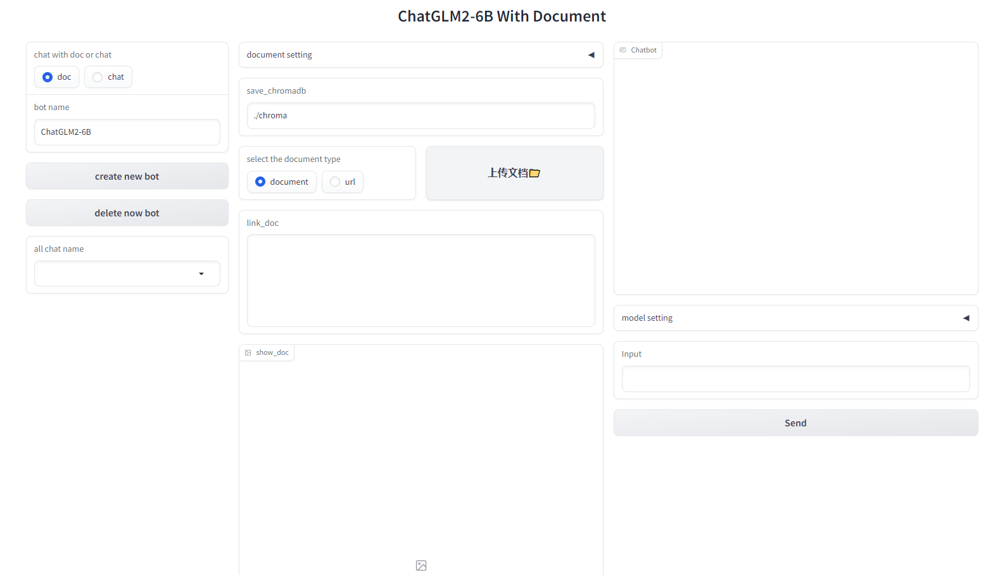

# ChatGLM2-ChatDoc
使用gradio、langchain、chroma、chatglm2-6b、text2vec 实现文档问答
## 更新
1. 需要增加流式输出
## 功能：
1. 用text2vec向量存储和查询，可以实现文档问答，可以添加和删除对话bot
2. 对话没有存储功能，停止运行释放历史记录。需要保存，在chat_doc_more.py的addHistory函数中保存，有标记TODO
3. 向量存储库可以设置存储路径。若文档名为英文，库名为文档名；若文档名为中文，库名为"china_"+文档名ASCII码用_连接。


## 使用
### 下载模型
1. 下载text2vec模型：https://huggingface.co/GanymedeNil/text2vec-large-chinese/tree/main ,放在text2vec/shibing624/目录下。项目链接：https://github.com/shibing624/text2vec
2. 下载chatglm2-6b模型：https://huggingface.co/THUDM/chatglm2-6b/tree/main ，下载慢可以使用 https://cloud.tsinghua.edu.cn/d/674208019e314311ab5c/ 。命名 chatglm2_6b 放在chatglm2_doc_code/目录下。项目链接：https://github.com/THUDM/ChatGLM2-6B
### 配置环境

```python
pip install -r requirements.txt
```

### 运行
1. 将chatglm2_doc_code下的config.json、doc_api.py、modeling_chatglm_docs.py复制到chatglm2_6b目录下
2. 运行doc_api.py启动chatglm2服务
3. 运行chat_doc_more.py启动对话